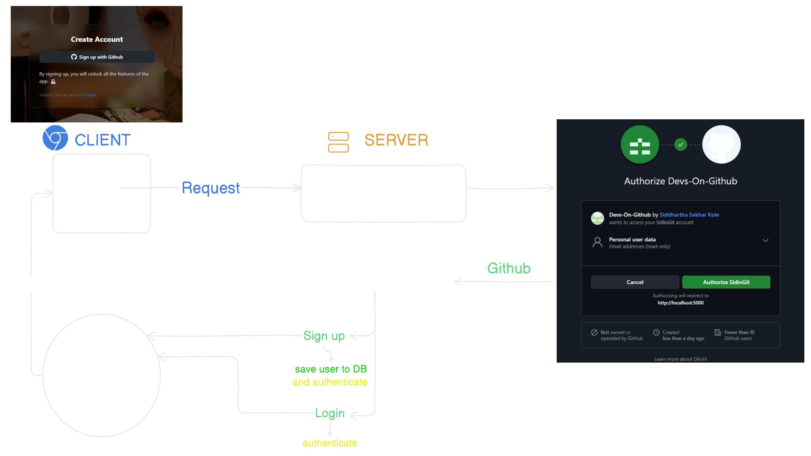

# Devs On Github
Built using the GitHub API, authenticated with PassportJS to find developers, explore, like projects, and filter repositories.

## About the Project  
- **Tech Stack**: MERN (MongoDB, Express, React, Node.js) with TailwindCSS and GitHub API integration.  
- **Authentication**: Secure GitHub OAuth implemented using Passport.js.  
- **Features**: Fetch and display GitHub user profiles and repositories.  
- **Client-Side Functionality**: Efficient repository filtering.  

## Passport JS authentication overview


## Deployment Steps
### 1. SETUP server.js (express.static, res.sendFile, path for react app)
```js
const __dirname = path.resolve();
app.use(express.static(path.join(__dirname, "/frontend/dist")));
app.get("*", (req, res) => {
  res.sendFile(path.join(__dirname, "frontend", "dist", "index.html"));
});
```
### 2. SETUP "build" and "start" scripts in package.json
```json
"scripts": {
    "dev": "nodemon backend/server.js",
    "build": "npm install && npm install --prefix frontend && npm run build --prefix frontend", // build
    "start": "node backend/server.js" // start
  }
  ```
### 3. Deploy on render.com with env variables

### 4. Update Github OAuth App (homepage url and callback url)

### 5. Add CLIENT_BASE_URL as env variable on render

### 6. Update the callback url on github.auth.js to full url (deployed url)
```js
callbackURL: "deployed-url/api/auth/github/callback"
```
